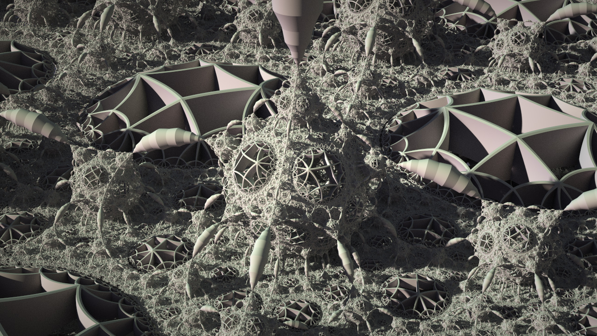

# <a name="title">Taichi SDF toy</a>

</img>

> Figure: result of `python3 pKlein.py`. :-)

Just messing with Taichi voxel challenge. 

**Taichi lang documentation:** https://docs.taichi.graphics/

Mouse and keyboard interface:

+ Drag with your left mouse button to rotate the camera.
+ Press `W/A/S/D/Q/E` to move the camera.
+ Press `P` to save a screenshot.
